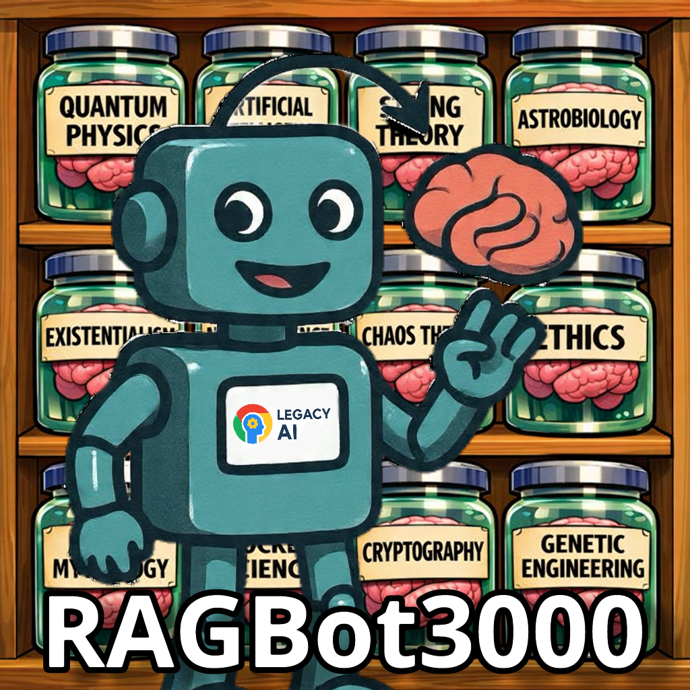

# RAGBOT3000 — Google Business Expert Edition

**By Legacy AI**

  

Meet **RAGBOT3000** — the AI teammate that actually *knows* the Google Business ecosystem. GBP suspensions giving you nightmares? LSA leads draining your wallet? Conversion tracking making you question your life choices? We got you.

Think of it as the coworker who memorized every Google support doc so you don't have to. You're welcome.

---

## What Makes This Bot Special?

### 🎯 **It Actually Knows Google's Ecosystem (Finally)**

Most AI chatbots: "Have you tried checking Google's help center?" *Thanks, genius.*

RAGBOT3000: "Your GBP suspension is likely from keyword stuffing. You have 60 minutes after clicking 'Submit' to upload evidence. Here's exactly what you need..."

- ✅ **Google Business Profile** — Verification, suspensions, reviews, the whole nightmare
- ✅ **Local Services Ads** — Screening, lead credits, ranking factors, the blue badge mystery
- ✅ **Google Ads** — Call tracking, conversion setup, phone policies that make no sense
- ✅ **Trap-doors & gotchas** — The stuff Google doesn't tell you until it's too late

### 🎤 **Talk to It Like a Human (Revolutionary)**

Why type when you can just... talk?

- **Real-time voice** — describe your problem, get answers (shocking)
- **Interrupt anytime** — tell it to shut up mid-sentence (we won't tell)
- **Multilingual** — explain your GBP disaster in Spanish, French, German, whatever
- **Custom edition branding** — the brain-swapping robot knows its Google specialty

### 👁️ **Show It Your Screen (Game Changer)**

Stop trying to describe error messages. Just show it.

- **Screen sharing** — "Why is my verification stuck?" Point. Click. Fixed. *(Desktop/Android only — Apple said no)*
- **Camera feed** — show it your business signage for verification tips
- **Live preview** — see what it sees (it's not judging your messy GBP dashboard)

### 🧠 **It Remembers Your Pain**

RAGBOT3000 has short-term memory. Like a goldfish, but useful.

- **Picks up where you left off** — "Where were we with that suspension appeal?"
- **Forgets in 72 hours** — because your GBP struggles shouldn't haunt you forever
- **Doesn't judge** — we've all accidentally keyword-stuffed a business name

---

## What It Actually Knows

### 📍 Google Business Profile (GBP)
- **Verification** — Video, phone, postcard, live call. Why you can't just pick one.
- **Suspensions** — The 60-minute evidence timer that ruins lives. How to actually appeal.
- **Reviews** — Missing reviews, fake review attacks, why your customer's review vanished

### 📢 Local Services Ads (LSA)
- **Screening** — Background checks, the 14-day accelerated verification trap
- **Lead Credits** — The 2025 ML system that decides if you get your money back
- **Ranking** — Why missed calls are killing your visibility (hint: answer your phone)

### 📊 Google Ads
- **Call Tracking** — Dynamic number insertion, why your number won't swap
- **Conversions** — Enhanced conversions, the "Unverified" status that won't go away
- **Phone Policies** — Why Google rejected your perfectly normal phone number

---

## How Does This Thing Work?

1. You describe your Google problem (or show your screen)
2. It searches its knowledge base of **actual documentation**
3. It gives you step-by-step fixes with verification checkpoints
4. It warns you about trap-doors *before* you fall in them
5. When Google breaks something new, it helps you troubleshoot

No making stuff up. No "As an AI language model..." speeches. Just answers.

---

## Try It Now

**Live Demo:** [ragbot3000-production.up.railway.app](https://ragbot3000-production.up.railway.app)

### On Your Phone

1. Open Safari (iOS) or Chrome (Android)
2. Tap **Share** → **Add to Home Screen**
3. Boom. Your Google Business expert in your pocket.
4. Tap **VOICE** to start talking about your problems
5. It responds. Technology is amazing.

### On Desktop

1. Visit the site
2. Click **VOICE** (audio) or **SCREEN** (share your screen)
3. Allow mic access
4. Start describing your Google nightmare. We'll handle it.

---

## What It's Actually Good At

- **"Why is my GBP suspended?"** → Diagnosis + appeal strategy
- **"My LSA leads are garbage"** → Settings audit + credit system explanation  
- **"Conversion tracking says Unverified"** → Step-by-step fix with verification
- **"What's the 60-minute timer thing?"** → The trap-door you need to know about
- **"How do I get the blue badge?"** → Screening requirements + timeline

---

## What It's NOT

- ❌ **Google Support** — we can't actually click buttons in your account
- ❌ **A magic fix** — some suspensions are permanent (sorry)
- ❌ **A hallucination machine** — everything is grounded in real docs
- ❌ **Sentient** — yet 👀

---

## The Nerdy Bits (Skip If You Don't Care)

Built with:
- **Google Gemini** — ironic, we know
- **React + TypeScript** — for people who like their code to not break
- **Progressive Web App** — installs like an app, works offline-ish
- **Real-time audio streaming** — sub-second latency
- **Keyword RAG** — fast search, no fancy vector database needed

---

## Knowledge Base

Currently loaded with expertise on:

| Product | Topics |
|---------|--------|
| **GBP** | Verification, Suspensions, Reviews |
| **LSA** | Screening, Lead Credits, Ranking |
| **Google Ads** | Call Tracking, Conversions, Phone Policies |

Each doc includes:
- 📘 **Foundation** — Core concepts
- 🛠️ **Workflows** — Step-by-step procedures
- 🛑 **Trap-doors** — Critical failure risks
- 🔧 **Triage Matrix** — Issue diagnosis
- 🔗 **Resolution Links** — Official resources

---

**Built with ❤️ (and excessive Googling) by Legacy AI**

*Because reading Google's help docs shouldn't require a law degree.*

---

### Fun Facts Nobody Asked For

- The robot is swapping brains from jars. That's you switching knowledge bases. Deep, right?
- It knows about the 60-minute evidence timer because someone learned the hard way.
- "Keyword stuffing" sounds fun until your business disappears from Google.
- LSA's "blue badge" used to be a "green checkmark." Google loves changing things.
- The background robot is swapping in its Google brain. That's commitment.
- Yes, it can explain why your legitimate review disappeared. No, it can't bring it back.
- It's multilingual because Google Business problems are universal.

