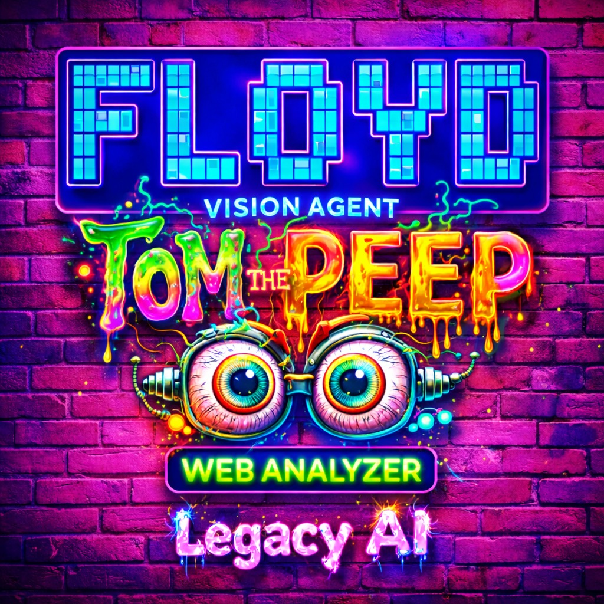

# RAGBOT Web Analyzer

**The Ultimate Vision and Accessibility Analyzer for LLM Integration**

<div align="center">
  
</div>

---

## Finally, an AI That Truly Sees and Understands Web Pages

RAGBOT Web Analyzer is a comprehensive web analysis tool designed to provide detailed visual, accessibility, and technical observations. It serves as a "vision" system for LLMs, enabling them to navigate and interact with web pages through detailed, structured observations.

---

## Core Capabilities

### 🔍 **Ultimate Vision Analysis**
- **Complete CSS Extraction** - Every style rule, computed value, and specificity analysis
- **Layout System Detection** - Flexbox, Grid, and responsive behavior analysis
- **Visual Hierarchy Mapping** - Element relationships, positioning, and visual weight
- **Animation & Transition Tracking** - All motion effects documented with timing

### ♿ **Comprehensive Accessibility Audit**
- **WCAG 2.1 Compliance** - Full AA/AAA level analysis with axe-core integration
- **Screen Reader Compatibility** - ARIA labels, landmarks, and reading order
- **Keyboard Navigation** - Tab order, focus indicators, and skip links
- **Color Contrast** - Real-time ratio calculations with WCAG level compliance

### 🐛 **Technical Issue Detection**
- **HTML Validation** - Semantic errors and best practice violations
- **Performance Analysis** - Resource sizes, load times, and optimization opportunities
- **Security Assessment** - HTTPS status, mixed content, and security headers
- **JavaScript Error Capture** - Runtime errors and console warnings

### 🎯 **Dual-Mode Interface**

#### For Human Reviewers
- **Natural Language Queries** - "What accessibility issues exist?" or "Analyze the navigation"
- **Visual Score Cards** - Overall scoring with prioritized fix recommendations
- **Issue Prioritization** - Critical, high, medium, and low severity classification

#### For LLM Integration
- **Structured JSON API** - All observations in parseable, detailed format
- **Navigation Guidance** - Element selectors, coordinates, and interaction methods
- **Command Execution** - Click, navigate, extract text, and manipulate elements
- **Memory Persistence** - Continuous observation stream for context-aware assistance

---

## How It Works

### 1. **Page Analysis**
Automatically scans the current page for:
- Visual structure and layout patterns
- Accessibility compliance issues
- Technical errors and warnings
- User experience problems

### 2. **Verbose Observation Generation**
Creates detailed reports including:
- Complete CSS property extraction
- Element relationships and hierarchies
- Accessibility violation details
- Performance bottlenecks

### 3. **Dual Interface Communication**
- **Human Mode**: Conversational queries about page issues
- **LLM Mode**: Command-driven interaction and data extraction
- **Dual Mode**: Simultaneous human and LLM interaction

### 4. **Persistent Memory**
- Maintains observation history
- Tracks navigation patterns
- Stores analysis results
- Provides context for follow-up queries

---

## API Endpoints for LLM Integration

### Get Observations
```
GET /observations?verbosity=verbose
```
Returns complete page analysis in structured JSON format

### Execute Commands
```
POST /command
{
  "command": "click_element",
  "parameters": {
    "selector": "#submit-button"
  }
}
```
Available commands:
- `click_element(selector)`
- `navigate(url)`
- `extract_text(selector)`
- `get_element_property(selector, property)`
- `wait_for_element(selector, timeout)`
- `scroll_to_element(selector)`
- `analyze_element(selector)`

### Memory Access
```
GET /memory
```
Full session history and observations

### Status Check
```
GET /status
```
Current page info and analysis state

---

## Example LLM Integration

```javascript
// Get detailed page observations
const observations = await fetch('/observations?verbosity=verbose')
  .then(r => r.json());

// Navigate to a specific element
await fetch('/command', {
  method: 'POST',
  headers: { 'Content-Type': 'application/json' },
  body: JSON.stringify({
    command: 'click_element',
    parameters: { selector: '.main-menu' }
  })
});

// Extract form data
const formData = await fetch('/command', {
  method: 'POST',
  headers: { 'Content-Type': 'application/json' },
  body: JSON.stringify({
    command: 'extract_text',
    parameters: { selector: 'form input' }
  })
});
```

---

## Why RAGBOT Web Analyzer?

### For LLMs
✅ **True Vision Capability** - See and understand web pages beyond text extraction
✅ **Navigation Assistance** - Guide users through complex interfaces
✅ **Context Awareness** - Understand page structure and user flows
✅ **Interaction Capability** - Click, scroll, and manipulate elements

### For Humans
✅ **Comprehensive Analysis** - Every aspect of web quality evaluated
✅ **Actionable Insights** - Clear, prioritized recommendations
✅ **Educational Value** - Learn about web accessibility and best practices
✅ **Continuous Monitoring** - Track improvements over time

---

## Features at a Glance

| Feature | Description |
|---------|-------------|
| **CSS Analysis** | Complete style extraction with specificity and inheritance tracking |
| **Layout Detection** | Flexbox, Grid, and responsive behavior analysis |
| **WCAG Compliance** | Full accessibility audit with axe-core integration |
| **Performance Metrics** | Load times, resource optimization, and bottlenecks |
| **Security Scan** | HTTPS, mixed content, and security header analysis |
| **LLM Integration** | Structured data and command execution APIs |
| **Human Interface** | Natural language queries and visual reports |
| **Memory System** | Persistent observation storage and session history |

---

## Try It Now

**Development Mode:**
```bash
cd RAGBOT3000-WEBANALYZER
npm install
npm run dev
```

**Production URL:** [Available after deployment]

---

## Built for the Future of Web Interaction

RAGBOT Web Analyzer bridges the gap between human web accessibility and machine understanding. By providing comprehensive, structured observations, it enables LLMs to truly "see" and interact with web pages while giving humans the detailed insights they need to create better, more accessible web experiences.

---

*RAGBOT Web Analyzer - Vision for LLMs, Clarity for Humans*